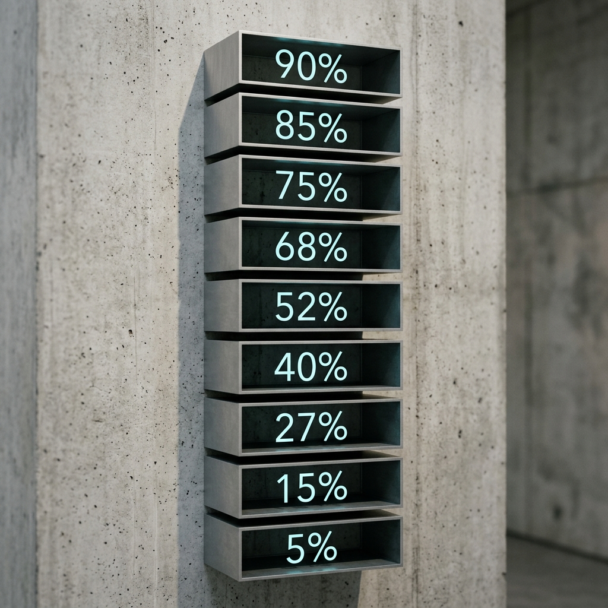

<p align="center">
  
</p>

# Kimi Code Usage: The Curated Toolchain

**Manifesting your AI quota with aesthetic precision across CLI, MCP, and VS Code.**
**以优雅的姿态，在终端、AI 助手与编辑器中感知你的 AI 额度。**

---

### 🌟 Project Vision | 项目愿景

In the era of "Vibecoding," transparency of resources is a prerequisite for flow. **Kimi Code Usage** is a meticulously crafted toolchain — three components, one soul.

在"直觉编程"时代，资源的透明度是进入心流状态的前提。**Kimi Code Usage** 是一套精心打磨的工具链 — 三种形态，一个灵魂。

**Common Prerequisite:** A [Kimi Coding Plan](https://api.kimi.com/coding/v1) API Key, set as `KIMI_API_KEY` in your environment or `.env` file.
**统一前提：** 在环境变量或 `.env` 文件中设置 `KIMI_API_KEY`。

---

### ⚡ CLI Reporter | 终端报告器

> A Rich-rendered panel in your terminal. Zero noise, pure signal.
> 在你的终端中渲染出带有工业美感的配额面板。

**Install & Run:**
```bash
pip install kimi-code-usage
kimi-usage              # Aesthetic Rich panel
kimi-usage --json       # Machine-readable JSON
kimi-usage --plain      # Plain text output
```

Or run instantly without installing:
```bash
uvx kimi-code-usage kimi-usage
```

---

### 🔍 MCP Server | AI 智能体接口

> Exposes `get_kimi_usage` to any MCP-compatible AI Agent.
> 让你的 AI 助手能够主动感知你的额度状态。

Compatible with **Claude Code, Cursor, Windsurf, Hermes**, and any MCP-enabled agent.

**Add to your MCP config** (e.g., `~/.claude/settings.json`):
```json
{
  "mcpServers": {
    "kimi-code-usage": {
      "command": "uvx",
      "args": ["kimi-code-usage", "kimi-mcp"],
      "env": {
        "KIMI_API_KEY": "YOUR_KEY"
      }
    }
  }
}
```

Then simply ask your AI: *"Check my Kimi quota."* / *"帮我查一下 Kimi 用量。"*

---

### 💎 VS Code Extension | 编辑器插件

> A sleek status bar indicator with sensory color alerting.
> 状态栏实时显示剩余百分比，颜色随额度变化而呼吸。

**Install:** Search `Kimi Code Usage` in the VS Code Marketplace, or:
```bash
code --install-extension HainingYu.kimi-code-usage
```

**Configure** (`Settings > kimiUsage`):

| Setting | Description | Default |
| :--- | :--- | :--- |
| `apiKey` | API key (or reads `KIMI_API_KEY` env) | `""` |
| `refreshInterval` | Auto-refresh in minutes | `5` |
| `warnPercent` | Yellow caution threshold | `30%` |
| `criticalPercent` | Red alert threshold | `10%` |

**Usage:** Status bar shows `⬡ W:96% 5H:99%`. Hover for details. `Cmd+Shift+P → Kimi: Refresh`.

---

### 🎨 About the Curator | 关于策展人

Crafted with ❤️ by **Haining Yu**, an Art Curator and Vibecoder. This toolchain is part of a curated collection designed to bridge the gap between aesthetic curation and intuitive, AI-powered coding.

由 **Haining Yu** 精心打磨。作为一名艺术策展人与 Vibecoder，我将代码视作展览，力求在审美策展与直觉化 AI 编程之间寻找完美的平衡。

---

<p align="center">
  <strong>Enjoy the flow. Stay in the vibe.</strong>
</p>
