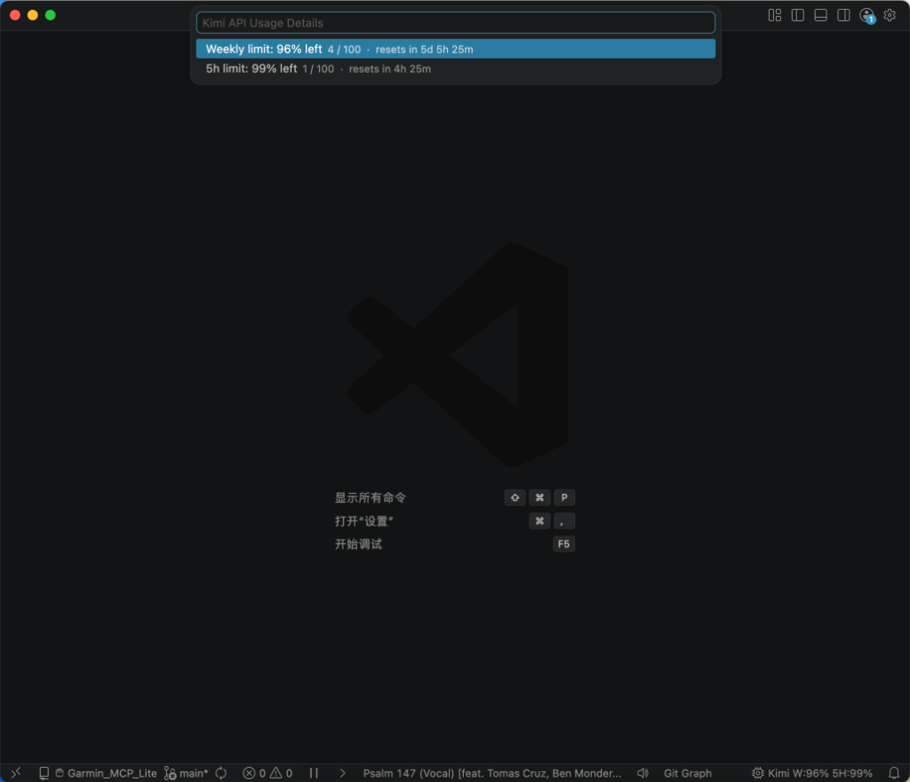

  

# Kimi Code Usage (Kimi 用量监控)

  
  
  

  <strong>Manifesting your AI quota with aesthetic precision.</strong> 
  <strong>以优雅的姿态，感知你的 AI 额度。</strong>

---

### 🌟 Why Kimi Code Usage? | 为什么选择它？

In the era of "Vibecoding," your flow shouldn't be interrupted by unexpected quota limits. **Kimi Code Usage** is a curated extension that brings transparency to your AI consumption, allowing you to focus on creation while staying aware of your resources.

在“直觉编程”时代，你的灵感流不应被突如其来的额度超限所打断。**Kimi Code Usage** 为你的 AI 消耗提供透明的实时监控，让你在专注创作的同时，对资源状况了然于胸。

---

### 🖼️ Showcase | 效果展示

  

---

### ✨ Features | 功能特性

- **💎 Minimalist Status Bar | 极简状态栏**
  A sleek indicator showing remaining API quota percentage at a glance.
  极致简洁的百分比显示，一眼看清剩余额度。
- **🎨 Sensory Alerting | 色彩感知提醒**
  Intelligent color shifts to match your "vibe": 
  智能色彩预警，完美融入你的开发氛围：
  - `30%` Remaining: **Amber Caution** (保持关注)
  - `10%` Remaining: **Scarlet Alert** (紧急预警)
- **🔍 Deep Insights | 详尽数据流**
  Hover to reveal a precisely curated breakdown of your weekly and short-term limits.
  悬浮触发详尽的数据面板，掌握周限额与短时限额的每一处细节。
- **⚡ Quick Actions | 瞬时响应**
  - `Kimi: Refresh Usage` — Instant sync. (立即同步)
  - `Kimi: Show Details` — Deep dive into stats. (深度数据详情)

---

### 🛠️ Quick Start | 快速上手

1.  **Install** the extension from the VS Code Marketplace.
2.  **Configure** your API Key (Settings > `kimiUsage.apiKey`).
3.  **Vibe check!** Watch your quota manifest in the status bar.

1.  从商店**安装**插件。
2.  **配置** API Key（设置 > `kimiUsage.apiKey`）。
3.  **开启创作！** 在状态栏实时感知你的额度。

---

### ⚙️ Configuration | 配置详情

| Setting (设置项) | Description (说明) | Default |
| :--- | :--- | :--- |
| `apiKey` | Your Kimi API secret / API 密钥 | `KIMI_API_KEY` |
| `baseUrl` | API base URL / 接口地址 | `Kimi Coding V1` |
| `refreshInterval` | Auto-sync minutes / 自动刷新间隔 | `5` |
| `warnPercent` | Yellow caution threshold / 警告阈值 | `30%` |
| `criticalPercent` | Red alert threshold / 严重阈值 | `10%` |

---

### 🎨 About the Curator | 关于策展人

Crafted with ❤️ by **Haining Yu**, an Art Curator and Vibecoder. This extension is a piece of digital art designed to bridge the gap between aesthetic curation and intuitive, AI-powered coding.

由 **Haining Yu** 精心打磨。作为一名艺术策展人与 Vibecoder，我将代码视作展览，力求在审美策展与直觉化 AI 编程之间寻找完美的平衡。

---

  <strong>Enjoy the flow. Stay in the vibe.</strong>

